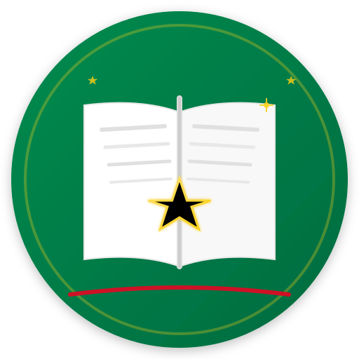

# OHCS E-Library

<div align="center">



### **AI-Powered Knowledge Management Platform for Ghana's Civil Service**

[](https://ohcs-elibrary.pages.dev)
[](https://github.com/ghwmelite-dotcom/ohcs-elibrary/releases)
[](https://workers.cloudflare.com)
[](https://www.typescriptlang.org/)
[](https://react.dev)
[](#license)

**[Live Demo](https://ohcs-elibrary.pages.dev)** | **[Try Demo Access](#demo-access)** | **[Features](#-features)** | **[Tech Stack](#-technology-stack)** | **[Getting Started](#-getting-started)**

</div>

---

## Overview

The **OHCS E-Library** is a comprehensive digital knowledge management and collaboration platform designed for Ghana's Office of the Head of Civil Service (OHCS). It empowers over 500,000 civil servants with AI-powered tools for document management, research, learning, wellness support, and professional networking.

### Highlights

- **40+ API Endpoints** - Comprehensive REST API powering all features
- **25+ Database Migrations** - Robust data architecture
- **100+ React Components** - Modern, accessible UI components
- **2 AI Assistants** - Kwame (Knowledge) & Ayo (Wellness)
- **Full LMS** - Complete learning management system with courses, quizzes, and certificates

---

## Demo Access

Try the platform without registration using our **Demo Access** feature:

1. Visit [ohcs-elibrary.pages.dev](https://ohcs-elibrary.pages.dev)
2. Click **"Try Demo Access"** on the login screen
3. Explore all features with a 24-hour demo session

Demo users get access to:
- Document library with AI analysis
- Kwame AI Knowledge Assistant
- Ayo Wellness Counselor
- Research Lab with Kofi AI
- Learning Management System
- Community forums and groups
- And much more!

---

## Features

### AI-Powered Assistants

| Assistant | Purpose | Capabilities |
|-----------|---------|--------------|
| **Kwame** | Knowledge Assistant | RAG-powered Q&A on civil service policies, procedures, HR matters. Cites official documents. |
| **Ayo** | Wellness Counselor | Anonymous mental health support, stress management, mood tracking, crisis resources. |
| **Kofi** | Research Partner | Policy brief generation, data analysis, literature review, research insights. |

### Core Modules

<table>
<tr>
<td width="50%">

#### Document Library
- PDF, Word, Excel, PowerPoint support
- AI-powered search & summarization
- Category & MDA organization
- Version history tracking
- Bookmarks & annotations
- Google Drive integration

#### Learning Management System
- Course creation & enrollment
- Video lessons & materials
- Quizzes with auto-grading
- Progress tracking & certificates
- Learning paths
- Admin analytics

#### Research Lab
- Project management with phases
- Literature linking & citations
- Collaborative discussions
- Milestone tracking
- 12+ research templates
- Export to PDF, DOCX, Markdown

</td>
<td width="50%">

#### Social Networking
- Professional profiles
- Connection requests & following
- Activity wall & posts
- Direct messaging with reactions
- Presence indicators
- User mentions

#### Wellness Hub
- Mental health resources
- Anonymous AI counseling
- Mood tracking & analytics
- Breathing exercises
- Crisis support hotlines
- Counselor escalation

#### Community Features
- Discussion forums with voting
- Professional groups
- Real-time chat rooms
- Voice messages
- File sharing
- Gamification & badges

</td>
</tr>
</table>

### Additional Features

- **News Aggregation** - Curated Ghanaian news with AI summaries
- **Notifications** - Real-time alerts and email digests
- **Calendar & Events** - Personal and organization events
- **E-Shop** - Internal marketplace for supplies
- **Peer Recognition** - Kudos and appreciation system
- **Two-Factor Auth** - TOTP-based security
- **Audit Logging** - Complete activity tracking
- **Admin Dashboard** - 15+ admin pages with analytics

---

## Technology Stack

### Frontend
| Technology | Version | Purpose |
|------------|---------|---------|
| React | 18.x | UI framework with concurrent features |
| TypeScript | 5.x | Type-safe development |
| Vite | 5.x | Build tool & dev server |
| Tailwind CSS | 3.x | Utility-first styling |
| Framer Motion | 10.x | Animations & transitions |
| Zustand | 4.x | State management |
| React Router | 6.x | Client-side routing |
| React Hook Form | 7.x | Form handling |
| Zod | 3.x | Schema validation |

### Backend
| Technology | Purpose |
|------------|---------|
| Cloudflare Workers | Serverless edge computing |
| Hono | Lightweight web framework |
| D1 Database | SQLite-based serverless DB |
| R2 Storage | Object storage for documents |
| KV Namespace | Session & cache storage |
| Workers AI | LLM & embedding inference |

### AI Models (Cloudflare Workers AI)
| Model | Tier | Purpose |
|-------|------|---------|
| `@cf/qwen/qwq-32b` | Heavy | Research, counseling (Dr. Sena), Ozzy RAG, document Q&A |
| `@cf/meta/llama-4-scout-17b-16e-instruct` | Light | Document summaries, topic extraction, news summarization |
| `@cf/baai/bge-m3` | Embedding | Multilingual document embeddings for RAG search (1024-dim) |

### Research Hub Enhancements
- **Full-Text Search**: FTS5-powered search across projects, notes, and literature with ranked results
- **File Attachments**: Upload and manage research documents via R2 storage (50MB limit)
- **Export Generation**: Compile research into Markdown/HTML with R2 storage and download
- **Advanced AI Analysis**: Literature gap analysis, question refinement, methodology suggestions, auto-tagging, cross-project insights
- **Research Notifications**: Team alerts for reviews, discussions, mentions, milestones, and phase approvals
- **Phase Approval Gates**: Formal approval workflow for advancing project phases
- **Ethics Tracking**: IRB/ethics approval records with status tracking
- **Audit Trail Export**: CSV export of all project activities for compliance
- **Contribution Tracking**: Points-based tracking of team member contributions

### Email Services
- **Gmail API** - OAuth2-based email delivery
- **Resend API** - Transactional email fallback

---

## System Architecture

```
┌─────────────────────────────────────────────────────────────────────────┐
│                          CLIENT LAYER                                    │
│  ┌───────────────────────────────────────────────────────────────────┐  │
│  │                    React SPA (Vite + TypeScript)                   │  │
│  │  • 100+ Components    • Zustand Stores    • Dark/Light Theme      │  │
│  └───────────────────────────────────────────────────────────────────┘  │
└─────────────────────────────────────────────────────────────────────────┘
                                    │
                                    ▼
┌─────────────────────────────────────────────────────────────────────────┐
│                       EDGE LAYER (Cloudflare)                            │
│  ┌─────────────────────────┐    ┌─────────────────────────────────┐    │
│  │   Cloudflare Pages      │    │     Cloudflare Workers (API)    │    │
│  │   • Static hosting      │    │     • Hono framework            │    │
│  │   • Global CDN          │    │     • JWT authentication        │    │
│  │   • Auto HTTPS          │    │     • Rate limiting             │    │
│  └─────────────────────────┘    └─────────────────────────────────┘    │
└─────────────────────────────────────────────────────────────────────────┘
                                    │
                                    ▼
┌─────────────────────────────────────────────────────────────────────────┐
│                          DATA LAYER                                      │
│  ┌──────────────┐  ┌──────────────┐  ┌──────────────┐  ┌────────────┐  │
│  │ D1 Database  │  │  R2 Storage  │  │   KV Cache   │  │ Workers AI │  │
│  │  (SQLite)    │  │ (Documents)  │  │  (Sessions)  │  │  (LLM/RAG) │  │
│  └──────────────┘  └──────────────┘  └──────────────┘  └────────────┘  │
└─────────────────────────────────────────────────────────────────────────┘
```

---

## Getting Started

### Prerequisites

- **Node.js** 18+
- **npm** 9+
- **Git**
- **Cloudflare Account** (for deployment)

### Installation

```bash
# Clone the repository
git clone https://github.com/ghwmelite-dotcom/ohcs-elibrary.git
cd ohcs-elibrary

# Install frontend dependencies
npm install

# Install worker dependencies
cd workers && npm install && cd ..

# Start frontend dev server
npm run dev

# In another terminal, start worker
cd workers && npm run dev
```

The application runs at `http://localhost:5173`

### Environment Configuration

**Frontend** (`.env`):
```env
VITE_API_URL=http://localhost:8787/api/v1
```

**Workers** (`workers/wrangler.toml`):
```toml
[vars]
ENVIRONMENT = "development"
JWT_SECRET = "your-secret-key"

# Email (Gmail API recommended for .gov.gh delivery)
GMAIL_CLIENT_ID = "..."
GMAIL_CLIENT_SECRET = "..."
GMAIL_REFRESH_TOKEN = "..."

# Google Drive Integration (optional)
GOOGLE_DRIVE_CLIENT_ID = "..."
GOOGLE_DRIVE_CLIENT_SECRET = "..."
GOOGLE_DRIVE_REDIRECT_URI = "..."
```

---

## Project Structure

```
ohcs-elibrary/
├── public/                      # Static assets & PWA icons
├── src/
│   ├── components/              # React components (100+)
│   │   ├── auth/                # Authentication UI
│   │   ├── kwame/               # Kwame AI chat components
│   │   ├── wellness/            # Ayo counselor components
│   │   ├── research/            # Research Lab components
│   │   ├── lms/                 # Learning system components
│   │   ├── social/              # Social networking components
│   │   └── ...
│   ├── pages/                   # Page components
│   │   ├── admin/               # Admin panel (15+ pages)
│   │   ├── Kwame.tsx            # AI Knowledge Assistant
│   │   ├── WellnessChat.tsx     # Ayo Wellness Counselor
│   │   ├── ResearchLab.tsx      # Research workspace
│   │   ├── LMS.tsx              # Learning system
│   │   └── ...
│   ├── stores/                  # Zustand state stores
│   ├── types/                   # TypeScript definitions
│   └── utils/                   # Utility functions
├── workers/
│   ├── src/
│   │   ├── routes/              # API routes (40+ endpoints)
│   │   │   ├── auth.ts          # Authentication + Demo login
│   │   │   ├── kwame.ts         # Kwame AI API
│   │   │   ├── counselor.ts     # Ayo counselor API
│   │   │   ├── research.ts      # Research Lab API (3800+ lines)
│   │   │   ├── lms.ts           # LMS API
│   │   │   └── ...
│   │   └── services/            # AI services (RAG, embeddings)
│   └── migrations/              # Database migrations (25+)
└── docs/                        # Documentation
```

---

## API Endpoints

### Authentication
| Method | Endpoint | Description |
|--------|----------|-------------|
| POST | `/auth/register` | Register with .gov.gh email |
| POST | `/auth/login` | Login with email/password |
| POST | `/auth/demo` | **Demo access** (24hr session) |
| POST | `/auth/logout` | End session |
| POST | `/auth/forgot-password` | Request reset code |

### AI Assistants
| Method | Endpoint | Description |
|--------|----------|-------------|
| POST | `/kwame/sessions` | Create Kwame chat session |
| POST | `/kwame/sessions/:id/messages` | Send message to Kwame |
| GET | `/kwame/suggestions` | Get suggested questions |
| POST | `/counselor/sessions` | Start Ayo counseling (supports anonymous) |
| POST | `/counselor/sessions/:id/messages` | Message Ayo |

### Documents, Forum, Chat, Groups, Research, LMS, Wellness
See [full API documentation](docs/API.md) for 40+ endpoints.

---

## User Roles

| Role | Access Level |
|------|--------------|
| `super_admin` | Full system access |
| `admin` | Administrative functions |
| `director` | Department management |
| `librarian` | Document management |
| `counselor` | Wellness dashboard access |
| `moderator` | Forum/chat moderation |
| `contributor` | Content creation |
| `civil_servant` | Standard user |
| `guest` | Limited read-only |

---

## Security

- **JWT Authentication** - Secure token-based auth with refresh tokens
- **Two-Factor Authentication** - TOTP with backup codes
- **Role-Based Access Control** - Granular permissions system
- **Rate Limiting** - API abuse prevention
- **HTTPS Everywhere** - TLS encryption in transit
- **Input Validation** - Zod schemas on all inputs
- **SQL Injection Prevention** - Parameterized queries
- **XSS Protection** - Content sanitization
- **Audit Logging** - Complete activity trail

---

## Deployment

### Frontend (Cloudflare Pages)
```bash
npm run build
npx wrangler pages deploy dist --project-name=ohcs-elibrary
```

### Backend (Cloudflare Workers)
```bash
cd workers
npm run deploy
```

### Database Migrations
```bash
npx wrangler d1 execute ohcs-elibrary --file=migrations/XXXX_migration.sql
```

---

## Design System

| Element | Color |
|---------|-------|
| Primary (Green) | `#006B3F` - Ghana flag |
| Accent (Gold) | `#FCD116` - Ghana flag |
| Danger (Red) | `#CE1126` - Ghana flag |
| Black Star | `#000000` - National symbol |

- **Light/Dark Mode** - Full theme support
- **Responsive** - Mobile-first design
- **Accessible** - WCAG 2.1 compliance
- **Animations** - Framer Motion transitions

---

## Version History

| Version | Date | Highlights |
|---------|------|------------|
| 2.0.0 | Jan 2026 | Demo access, Kwame/Ayo AI fixes, Google Drive integration |
| 1.5.0 | Jan 2026 | LMS, Social networking, Peer recognition |
| 1.1.0 | Dec 2025 | Research Lab Phase 4, Wellness Hub |
| 1.0.0 | Dec 2025 | Initial release |

See [CHANGELOG.md](CHANGELOG.md) for detailed history.

---

## Contributing

This is a proprietary project for Ghana's Office of the Head of Civil Service. Contributions are limited to authorized personnel.

### Development Guidelines
1. Follow TypeScript best practices
2. Write clean, documented code
3. Test thoroughly before committing
4. Use conventional commit messages

---

## License

**Proprietary License**

Copyright (c) 2025-2026 Office of the Head of Civil Service, Ghana. All rights reserved.

Unauthorized copying, distribution, or use of this software is strictly prohibited.

---

## Contact

**Developer:** Osborn Hodges
**Email:** davies.hodges@ohcs.gov.gh
**Organization:** Office of the Head of Civil Service, Ghana

**Live Platform:** [ohcs-elibrary.pages.dev](https://ohcs-elibrary.pages.dev)

---

<div align="center">

**Built with pride for Ghana's Civil Service**


</div>
